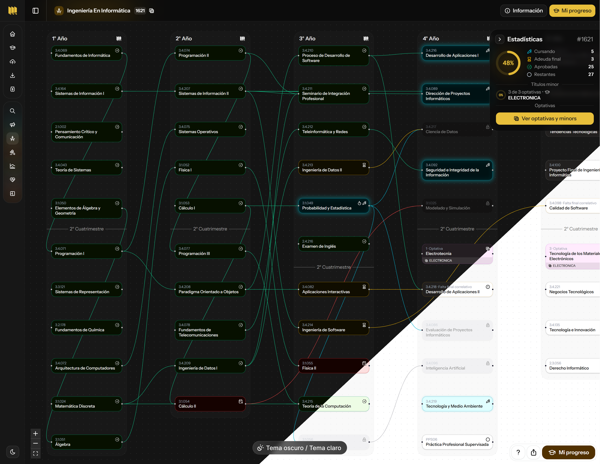

Con **Carrear** podés explorar tu plan de estudio de forma interactiva, registrar tu avance en la carrera, ver las correlativas de cada materia y organizar tus optativas o títulos minor

- Todas las facultades y planes, si tu plan todavía no esta disponible, podes subirlo desde la pestaña de [`Subir Plan`](https://carrear.fabriziob.com/uade/new)

- Todas las últimas materias optativas y planes, actualizadas en 2026.

- Seguimiento de materias cursadas, a recursar, con final pendiente. Opción de agrega optativas extras a las incluidas al plan.

- Puede ser usado como seguimiento de cursada, o visualizador de materias correlativas / optativas. (screenshot abajo)

- Todo se guarda localmente en tu buscador. (no descarto la creación de cuentas en un futuro para sincronizar dispositivos)

- 100% Gratis y sin anuncios, por siempre!

 
Mientras se lanzaron herramientas similares, estas limitan funciones detrás de un pago, Carrear busca ofrecer una experiencia completa, simple y gratuita para organizar tu carrera.

### Arquitectura
- IA como herramienta, no vibecoding.
- SPA generada con NEXT.js (elección debido a que necesitaba usar next.js en otro trabajo) todo generado estático en buildtime (spa, search, combinations, etc).
- React Flow para mapas y Supabase  como backend basico para subida de planes.
- Componentes Shadcn personalizados.
- Cloudflare para build, cdn, metricas.

> [!IMPORTANT]
> Carrear es Closed Source.

> El proyectó comenzo para el uso de mis amigos, luego pasando a ser Carrear. Idea de Athi <3 y el [genial proyecto](https://github.com/FdelMazo/FIUBA-Map) FIUBA-Map de @FdelMazo

#

Hecho con 🤍 por Fabrizio
